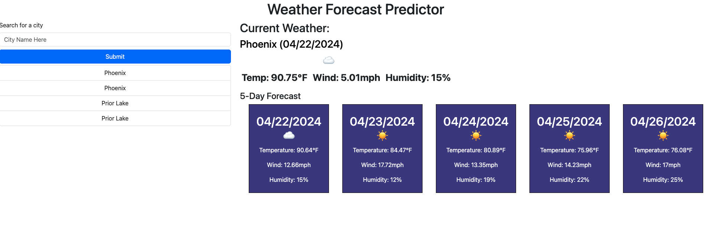

# Ben Parks Weather Forecast Site

## Description
This web application was built for people to be able to search for cities in the United States and find out what the weather is like there. It connects to Open Weather API to pull the information. 

## Purpose
This website was built to to showcase the interactive capabilities of user inputs and API calling. 

## Installation
No installation needed to view this website. Just to to https://benjamin-parks.github.io/Weather-Dashboard-BParks/ to view it. 

## Using the Website
Using this website is very simple. Just search the name of a city and click the submit button. All weather information (current or 5 day forecast will populate) on the website. The website holds previous searches in localStorage and appends them to the list as clickable buttons. The text value of those buttons are then passed back through the search functions of the javascript to reload their weather information on the page. 

## Screenshots

